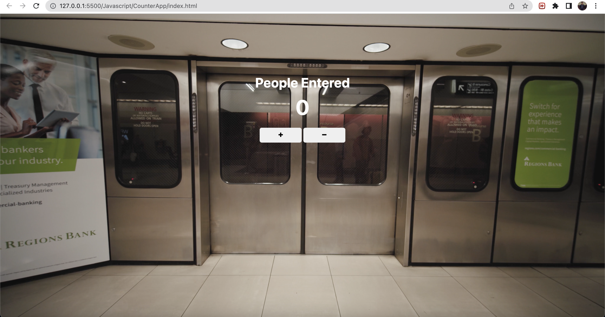

# Passenger Counter/ Counter App

# Tech Used
1. Html
2. CSS
3. JavaScript

# Functionality
1. Background Video
2. Sound when clicked on the + button
3. Sound when clicked on the - button
4. Warning sound when count goes < 0 

